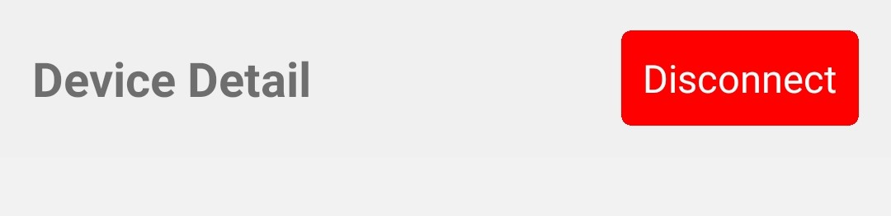
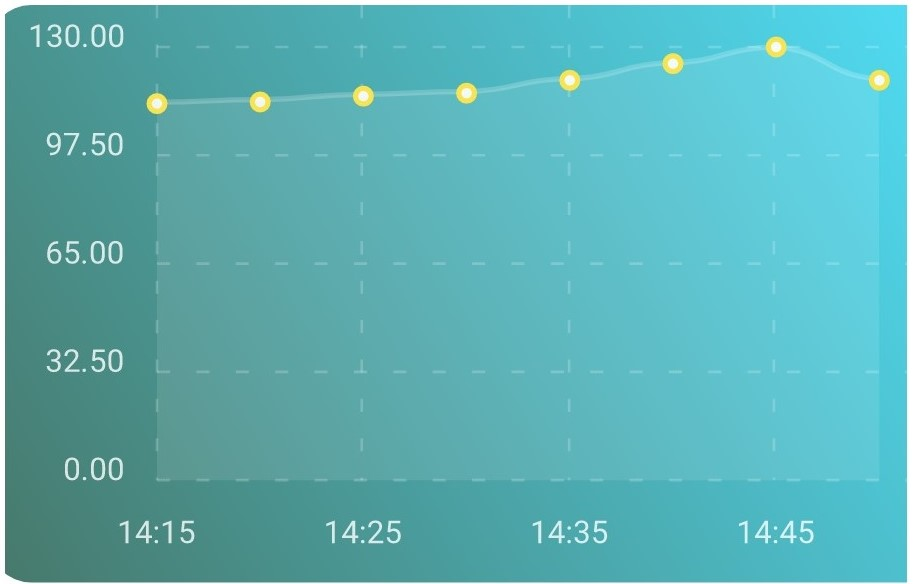

# Components Directory Documentation

## **CustomHeader.tsx**

File containing header displayed on the password and device detail screens. Header shows a title and a disconnect button. The disconnect button disconnects the application from the currently connect Raspberry Pi and returns to the start screen.

  ### *disconnectBleManager()*
  Method finds all connected device and then cancels the connection with each of them.

## **Line_graph.tsx**
File used to create all line graphs within the application. Data and labels are passed in as parameters and are used to create the line graph.

