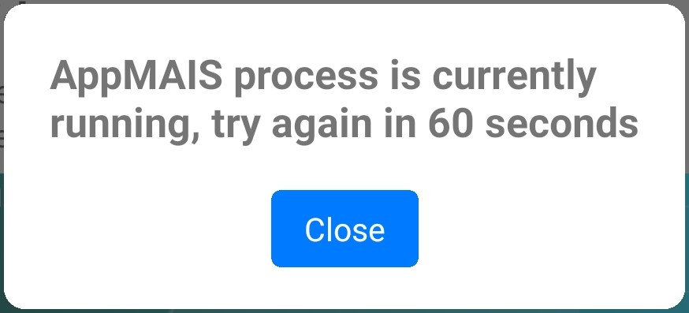
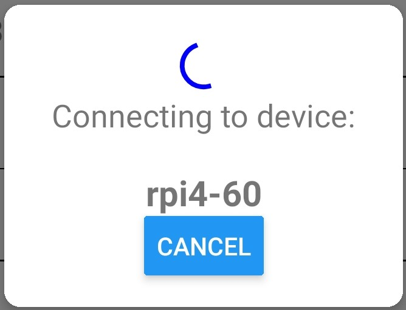
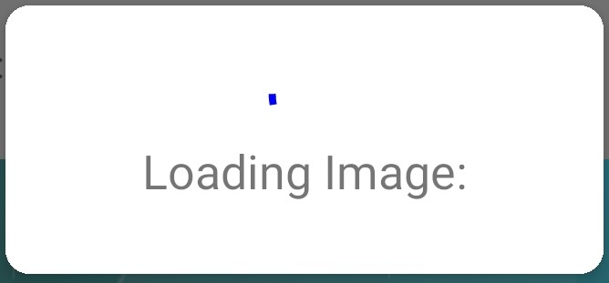
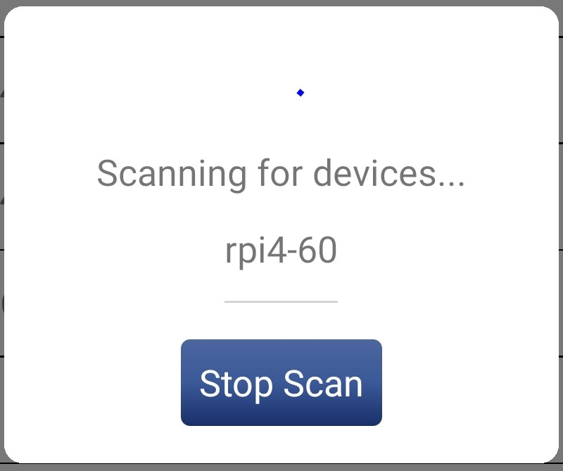

# Modals Directory Documentation

## **AppTimingModal.tsx**
Modal is used whenever an AppMAIS check occurs and it is determined that the AppMAIS process is currently running. It tells the user to wait about 60 seconds before attempting any function again.

## **ConnectingModal.tsx**
Modal displayed whenever the application is attempting to connect to a Raspberry Pi. Purpose is so the user knows that device connection is being attempted.

## **LoadingModal.tsx**
Modal displayed whenever the application is loading an image being pulled from the Pi. Purpose is so the user has a visual indication that an image is being pulled. Called in video_tab.tsx.

## **NanModal.tsx**
Modal goes along with each line graph in the application. Provides a detailed view of the data being displayed in the graph. Displays value of each data point along with there corresponding labels along with a colored point.
* Green -- Value pulled directly from Pi
* Red -- Nan reading pulled from Pi
* Yellow -- Nan reading pulled from Pi but value was interpolated based on surrounding points.

Also displays nan count (including interpolated values) and failure count (3 or more nan readings in a row).

## **ScanningModal.tsx**
Modal displayed when the 'scan for devices' button is pressed on the start screen. Displays a loading icon and found devices as they are found.

