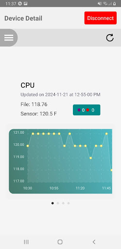

# Primary Screens of the Application
More information on the files containing each primary screen for the application. These files are DeviceListScreen.tsx, PasswordScreen.tsx, and DeviceDetailsScreen.tsx.

## **DeviceListScreen.tsx**
File for the start screen of the application. Displays a list of registered Raspberry Pi's. Can connect to a registered device or scan for unregistered devices.

### *connectToDevice()*
Method responsible for connecting application to Raspberry Pi. This method attempts a connection, if successful it navigates to the password screen. If unsuccessful it calls showRetryAlert(). 

### *startScan()*
Method called after pressing the 'scan for devices' button. Scans for and displays found devices. Used if the user wants to connect to a device which hasn't been registered yet. If a device is found, the user can select it to attempt to connect to it.

### *showRetryAlert()*
Alert shown if connection fails. Gives the user the option to either cancel connection or try again.

______________________________________
## **PasswordScreen.tsx**
File responsible for the password screen in the application. Where the user enters password in order to have access to the Raspberry Pi.

### *handlePasswordSubmit()*
Takes user input and writes it to characteristic on GATT server located on Raspberry Pi. It then reads the response from the Pi determining if the password was correct or not. If the password was correct, it navigates you to DeviceDetailScreen.

______________________________________________
## **DeviceDetailsScreen.tsx**
File holding the home page of the application. The methods in this file are responsible for getting data for each of the sensors. The data for this screen comes from the saved sensor files on the Raspberry Pi obtained through the AppMAIS recording process. 

### Methods for handling graph data
#### *get_graph_data()*
Acts as the main method for getting data for the line graphs to display. Creates a structure for each sensor to hold the results and calls the processData() function for each sensor.

#### *processData()*
Function works by caling Det_FileRead(), located in a seperate file, to pull sensor data from file on Raspberry Pi. It then loops through each line of data from this file and passes it to handle_graph_value(). 

#### *handle_graph_value()*
This function processes the line of data (label, value) that is passed in. In this method, we keep track of a few variables:

This is what makes up the line of data we are processing
* label -- The passed in label
* value -- The passed in value

These arrays hold the data passed into the graph. No nan values can exist in these arrays or an error will be thrown. So these arrays will only hold read values and interpolated values.
* graph_labels -- Array of labels which will be used for graph creation
* graph_values -- Array of corresponding values which will be used for graph creation

These arrays are used to hold all data we come across, nan or not. These are not used for graph creation. They are used for the nan modal which shows a more in depth look at the read data. This is so we can see when nan values were read.
* all_times -- Holds all labels whether they correspond to a nan value or not.
* all_values -- Holds all values, nan, number, or interpolated.

Variables used to hold the count of nan and failure counts in the read file. A failure is 3 or more nan readings in a row.
* nanCount
* failure_count

Variables responsible for getting interpolated values. As we go through each line of data in the file, as we run across nan values, we keep track of them with these variables. If we hit a line of data containing an actual value before we get to three nan readings in a row, we are able to interpolate a value for the nan readings. If we don't hit a line of data with an actual value and we get to over 3 nan readings in a row then we add to the failure count. 
* nan_occ_count -- Number of nan occurences in a row so far
* saved_nan_occs -- Saved labels of nan occurences
* interpolated_index -- Indeces of interpolated values.

### Methods for getting sensor and file data
#### *readAndParseFileData()*
Method responsible for reading most recent data from each sensor on Raspberry Pi. Either gets the most recent value including time of recording, or if the most recent recording is nan, it finds and returns at what time nan values began being recorded.

#### *processCpuLineData()*
Method called in readAndParseFileData(). Lines of data are different from each sensor so they need to be handled differently. This method is used for handling the data read from the cpu sensor file.

#### *processHumTempLineData()*
Method called in readAndParseFileData(). Lines of data are different from each sensor so they need to be handled differently. This method is used for handling the data read from the humidity and temperature sensor file.

________________________________________________
## **Det_FileRead.tsx**
File responsible for pulling a file from the Raspberry Pi. Here we are pulling csv files containing sensor data.

#### *Det_GraphData()*
The main method of the file. Depending on the sensor we are trying to read, it passes the needed UUID into perform_file_read() and returns the result.

#### *perform_file_read()*
Function responsible for reading data from csv file. The GATT server can only pass so much data at a time so we have to read the file in chunks. This function reads chunks of data from the pi until there are no more chunks to be read. It then appends all of these chunks together forming the original csv file. 

#### *getChunk()*
Function called by perform_file_read(). Reads and returns a chunk of data from the GATT server.
