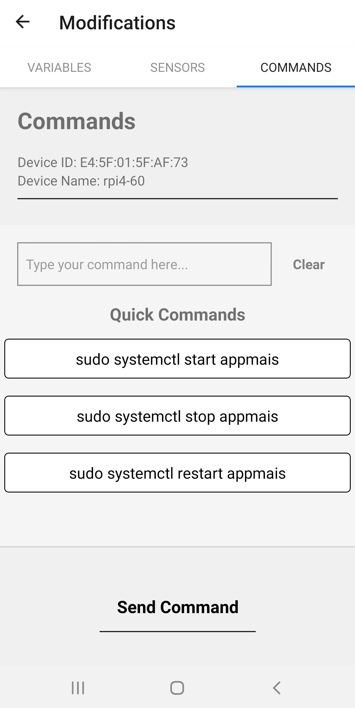

# Tabs Directory Documentation
This file goes over the files modifications.tsx, commands.tsx, video_tab.tsx, and sensors.tsx. These are all located at 'src/views/tabs'.

## **modifications.tsx**
File responsible for displaying list of modifiable variables from the beemon-config.ini file on the Raspberry Pi. These variables include:
* *capture_window_start_time* -- At what time the AppMAIS process starts recording.
* *capture_window_end_time* -- At what time the AppMAIS process ends recording.
* *capture_interval_seconds* -- Time between sensor recordings.
* *capture_duration_seconds* -- How long the sensors record at each interval.
  
The app shows two sets of these variables. One set is for the camera and the other set for all the other sensors. This is so that the camera can be set to record at different times than the other sensors.

### Variables
#### *variables, setVariables useState*
Keeps track of the current config variable values.

#### *changedVariables useState*
Keeps track of variables that have been changed.

#### *originalVariables useState*
Keeps track of the original variable values. Used to make sure we don't update variables unless they have been changed.

### Methods
#### *readCharacteristic()*
Method used to read from a characteristic on the Raspberry Pi. Needs the UUID of the characteristic being read from.

#### *writeCharacteristic()*
Method used to write a given value to a characteristic on the Raspberry Pi. We are using this to change variable values in the beemon-config.ini file.

#### *fetchData()*
Method which calls readCharacteristic for each variable we want from the beemon-config.ini file. Used to get the current values from the file.

#### *submitChanges()*
Method which writes new values to variables in the config file. Only writes a value to the config file if the value has been changed.

#### *handleSubmit()*
Method called when the submit button is pressed. Checks if any variables have been changed to make sure were not needlessly updating variables. If variables have been changed then it shows the 'are you sure' modal. If the user then presses 'yes' then submitChanges() is called to update the variables.

## **commands.tsx**
File responsible for screen which is used to send commands from the application to run on the Raspberry Pi. 

### Variables
More detail about important variables before getting into methods

#### *command setCommand useState*
Holds the current command entered by the user. This is what is displayed in the command text box on the screen and what will be sent to be run on the Pi.

#### *quickCommands*
List of common commands. These are taken later and displayed below the text box. The user can then select one and it will auto fill the command into the command text box above.

#### *isModalVisible useState*
Used to set visibility of the 'Are you sure?' modal. This is displayed whenever the user submits a command to be sent.

#### *timing_modalVisible useState*
Used to set visibility of the AppTimingModal. We don't want to send a command while the AppMAIS process is running so if the AppMAIS process is running when the user presses send command, this modal is displayed letting them know to wait a minute before trying again.

### Methods
#### *sendCommand()*
Method used to send the command entered by the user to the Rasbperry Pi. 

## **sensorStates.tsx**
File responsible for displaying a list of sensors currently connected to the Pi. It displays each sensor and shows if the sensor is currently on or off. Here the user can turn sensors on and off. This works by changing the *auto_start* variable in the config file.

### Variables
#### *Variables ending in UUID*
These variables hold the service UUID and the characteristics UUID. We need these to access the service and characteristics within the GATT server.

#### *variables setVariables useState*
Used to set boolean values of each sensor. true = on, false = off.

#### *originalVariables setOriginalVariables useState*
Used to keep track of original values. So we only update sensor states if they have been changed from what they were originally.

### Methods
Methods in this file are very similar to methods in modifications.tsx. They are basically the same just calling different characteristics.

#### *fetchData()*
Method which calls readCharacteristic for each sensor. Used to get the current states of each sensor.

#### *readCharacteristic()*
Method used to read from a characteristic on the Raspberry Pi. Needs the UUID of the characteristic being read from.

#### *writeCharacteristic()*
Method used to write a given value to a characteristic on the Raspberry Pi. Used to change sensor states via the auto_start variable in the beemon-config.ini file.

#### *submitChanges()*
Method used to write changed sensor states to config file. Onyl updates sensor states if they have been changed.

#### *handleSubmit()*
Shows the 'Are you sure?' modal. If the user presses yes on that modal then it calls submitChanges() to update the sensor states.

